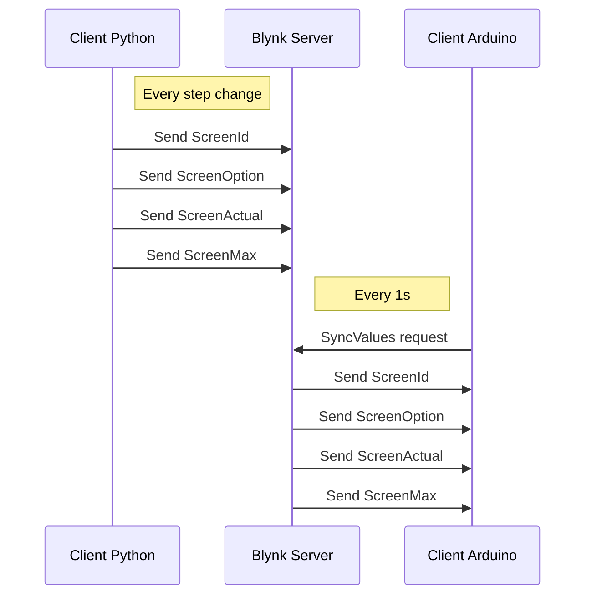

# Rollout-makers
Rollout project for the 2019 We make it happen Contest

## Project Description

## Setup the environment

### Sources
Checkout the project from https://github.com/acatoire/rollout-makers

The target board is node32s

### Needed arduino libraries
All needed library are copied in the Libraries folder for quick setup

### Mounting project libraries
From the Libraries edit mount.bat with the correct path by editing arduino_lib_path and project_lib_path.

Example:
'''
set arduino_lib_path="C:\Users\axel\Documents\Arduino\libraries"
set project_lib_path="C:\gitfolder\rollout-makers\Libraries
'''

Save the bat file and execute it as administrator(right click)

Now Library from the the project's Library folder will be seen as a arduino library.

### Online tools
- [Pixel drawing tool](https://www.pixilart.com/draw#)
- [Markdown writing](https://stackedit.io/app#)
- [RGB656 color picker](http://www.barth-dev.de/online/rgb565-color-picker/)

# Contest rules

## In a nutshell:
Nowadays, setting up clever solutions in the context of sensors, actuators and IoT is not a matter of cost anymore, leading to an increasing number of people who get used to ‘play’ in this context – also here at Vaillant Group. In order to connect such ‘MAKERS’ with each other and give a platform to share creative solutions, we want to provide single MAKERS or MAKER TEAMS with a common hardware set and let them create cool solutions based on the hardware environment. In some months we share the generated projects and want to honour the ‘best’ MAKERS.

## The rules:
### Timing: 3 month
–	Start: 1st of June 2019
–	End: 31st of August 2019

### Sponsoring
IRE is sponsoring a defined development kit (see below) for all participating MAKERS to ensure a certain base for exchanging between teams and ideas. 

3 sets for the entire team.

Your idea has to use the provided development kit:
Additional components or modules (sensors, actors, …) may be added by you. 
The solution shall have a machine-to-machine OR IoT communication element. 
There is no need for an HVAC context.

### Homework
You have to do this creative project in your private time / at home.

### The development kit comprises:
- An ESP32 based Node MCU module
- An Adafruit RGB-LED-matrix with 32 x 16 pixels
- All electronic components to realise a level shifter (needed between Node MCU and RGB-matrix-driver)
- A wall-plug power supply to drive the electronics 
- A guide to build up the level shifter and getting started with the software

Kit Info:
- [How to from ebenfeld.de](https://www.ebenfeld.de/2019/05/16/esp32-with-adafruit-medium-rgb-matrix-panel/)
- [other link](https://wiki.ai-thinker.com/esp32/boards/nodemcu_32s)

### Something to win?!
a.	A jury (lead by Sven Ebenfeld / Clemens Fahr / Jochen Wriske) will evaluate the ideas based on some principles:
–	”Creativity OVER Complexity“ (or  “Coolness OVER Coding Effort”)
–	“Project description OVER Arts“ (or “code re-usability” OVER “polished surfaces”)  
a.	The 1st price will be “a voucher for a dinner”, but we believe more in the Olympic Idea! Additionally the winner gets the honour to „Run the next event“!

