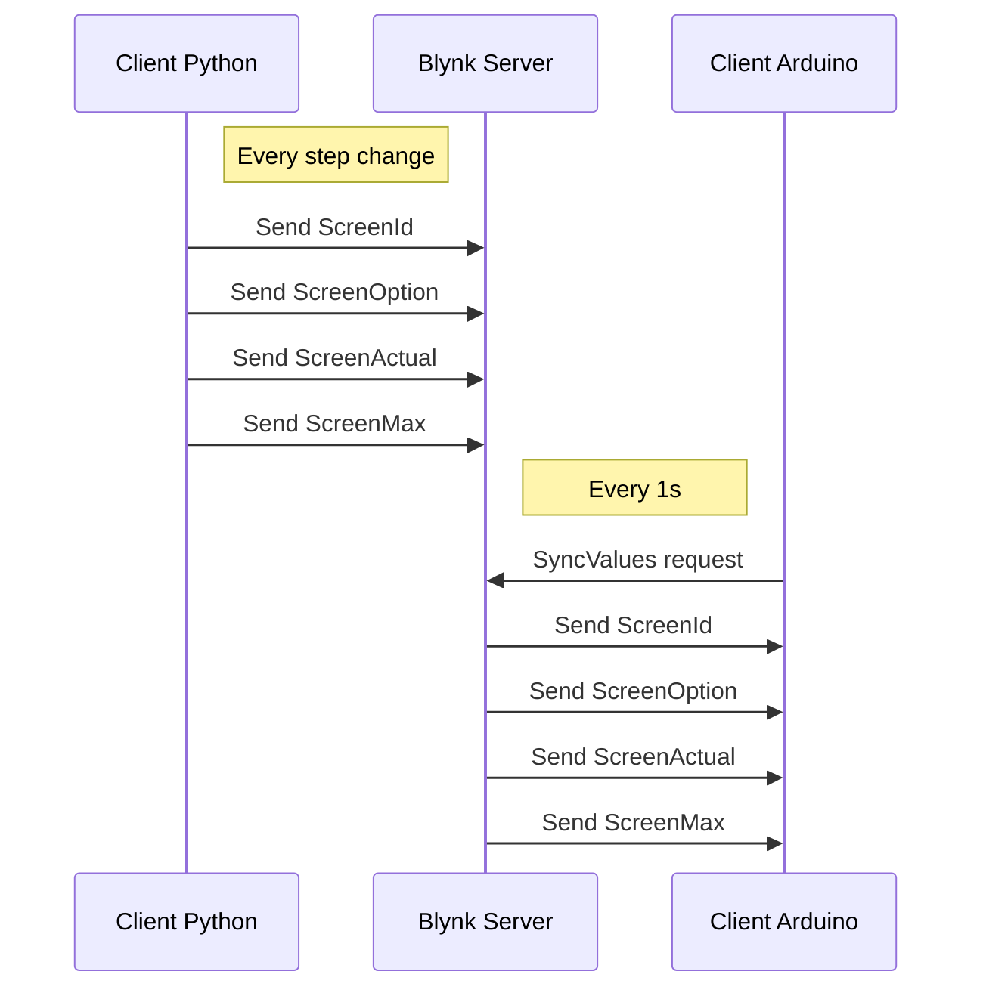

# Rollout-makers
Rollout project for the 2019 We make it happen Contest

Github link: https://github.com/acatoire/rollout-makers

## Project Description
The project is a home automation screen.

The first implemented use case is a screen setup in your home and/or office which motivate you to use light global warming emission gas vehicle(or feet ;)).

The screen will compare on google maps the distance/time/co² of transportation ways to convince you to choose the best one.

## Fun facts
Coding the app, we were able to see some really interesting comparison depending on the hour of departure for our personal direction:
- 8h      25mn by bike      30mn by car
- 10h     24mn by bike      13mn by car
- 18h     25mn by bike      45mn by car

That was really interesting to see it live and encouraging to continue the concept.

## To continue
To improve the concept we decided to implement multiples information that can be shown on the screen at the right moment for the user.

Battery level of your bike/car, giving a reminder to charge it.
Google Map API refresh after start up
Set of works events screens useful for vaillant allowing to print:
 * test campaign status (AITT)
 * Continuous Integration status (jenkins)

We also added a dedicated motion detector lib allowing to trigger screens on physical event. 

## Project Components
The project will be composed of several components:
 - The screen, running on esp32
 - A detector to start event from the esp32
   * On movement detection start a bike/car compare on the screen for morning boost
 - A Blynk server that host communication with other home automation elements.
   * https://blynk.io/ services has been chosen for quick proof of concept
 - Multiples python clients to update the screen for : 
   * Home automation events 
   * Works events (Jenkins, AITT…)
   * Running script event

## Difficulties during development

### Google Map API
Make the existing google API library working again.

Due to updates of other libraries, the trunk version on the web didn't work anymore.
Our fixies are enough to make a demonstration, but some minor bugs are still present and could be fixed in the future.

In addition, we added the transportation option in this library, the original lib works only for car, now it is ready for bike, tram, bus... 

In order to do it we did a fork of the lib and push our solution to the original author.

### Arduino structure
It takes us some time to split function into classes to be able to have a team workable environment. Arduino is really good for quick proof of concept but the IDE is not very friendly. We started to work on Visual Studio Code to improve the working experience.

### Hardware research
We wanted to plug our electric bike to the esp, but we missed some time for that.
Summer is not that easy with holidays to find spare time to work, future contest should be done on winter with its long cold nights ;-)

# Into The Code

## The Folder organisation

App:     Other app developed to communicate with our screen (for now only a concept of python client)
Doc:     For … documentation
Externals Libraries: Lib taken as it is on the web or arduino constellation, saved as module on our git for a quick install using Mount.bat.
Libraries: Lib forked or writen by us can be quickly installed using Mount.bat.
Sketches: Folders with all developed arduino sketches.

## How to start the demo

- Copy the full project folder on your computer (or fork/checkout it from github)
- Edit the two Mount.bat to have the right folders location on your machine
- Execute the two mount.bat in Libraries and Externals Libraries folders
- Edit the Config.h in Sketches/Ook_Screen with your wifi and google map api
- You can then start Ook_Screen.ino with your usual arduino environment
- Optional : You can use our blynk app by flashing the QR code from the project folder with blynk android or iphone app
- 

## Sketches
We did develop the projects by step, allowing to split the work between each member of the team. We then create multiples arduino sketches to achieve our goal.

### Test Sketches
- test_google_map_request: used to debug and improve the google API library.
- test_detection_sensor: used to developed a library related to the presence/detection sensor.
- test_google_distance_class and test_google_distance_direct: used to develop our library "MyTravel".
- test_screen_class: used to develop our library "MyScreen".
- test_web_server: used to developed the web/connectivity functions.

### Final sketches
- Ook_Screen: This sketch is the final project done for the demo. It assemble all the software part developed into tests sketches. It has been used for the project presentation video.

## Libraries
### Tool : Mount.bat
Library folder contain a batch file use to easily mount all libraries of the folder on your computer. It creates symbolic links between arduino library folder and the project folder. It’s avoid to copy the libraries at different places on your computer.
Only tested on (win7/8/10).

### Libraries developed by the team (TrollOutLib)
- MyScreen: contains functions to drive the screen
- MyScreenBmp: contains functions to draw bitmap on the screen
- MySensor: contains functions regarding the presence/detection sensor
- MyTravel: contains functions used to set travel options (transportation mode, addresses,...)
- MyValue.cpp: contains function to make operation on a value

### Library modified/fixed by the team
- GoogleMapApi: existing arduino library create to make google map request.We modified because It was outdated and some request options for our project were missing.

### Library directly used by the team
- Adafruit_GFX_Library: supplied library to drive the Adafruit screen
- Blynk: library used with the Android application which has the same name. It allows us to drive our application with smartphone.
- RGB-matric-Panel-master: library which add function to drive RGB matrix
- Json-streaming-parser: library used by the GoogleMapApi library in order to parse API request answer

### ESP32 embedded library
All other libraries used into the project are directly available when you compiled on a node32s target into arduino IDE.

# Into The Ook screen 
Technical references used on the project for the communication with the blynk server

## Screens commands

The blynk server host the following elements:
 - ScreenId (V10)
 - ScreenOption (V11)
 - ScreenActual (V12)
 - ScreenMax (V13)
 - ScreenText (V14)

## Client/Server interactions

To read the following diagram use [stackedit](https://stackedit.io/app#)

## Command table

| Id  | Option | Actual | Max | Action on screen                
|-----|--------|--------|-----|---------------------------------
|  0  |   id   |    -   |  -  | Default welcome screen, draw a picture, option is the picture id
|  1  |    -   |    y   |  z  | Test bench running screen : line1 = ScreenText line2 = y / z
|  1  |    1   |    -   |  -  | Test bench Fail screen
|  1  |    2   |    -   |  -  | Test bench Success screen
|  2  |    -   |    -   |  -  | Jenkins Alert screen : line1 = ScreenText line2 = FAILED
|  3  |    -   |    -   |  -  | Mobility Companion screen : option/actual choose the mobility to compare
|  4  |    -   |    %   |  -  | Battery screen : actual is 0% to 100%
|  5  |    -   |    -   |  -  |
|  6  |    -   |    -   |  -  |
|  7  |    -   |    -   |  -  |

## Mobility id table

| MobilityId | type
|------------|--------------
|     1      | Walk
|     2      | Bike
|     3      | Tram/Bus
|     4      | Car

## Picture table

| PictureId | Picture
|-----------|--------------
|     0     | No
|     1     | Walking man
|     2     | Bike
|     3     | Car
|     4     | Train
|     5     |
|     5     |
