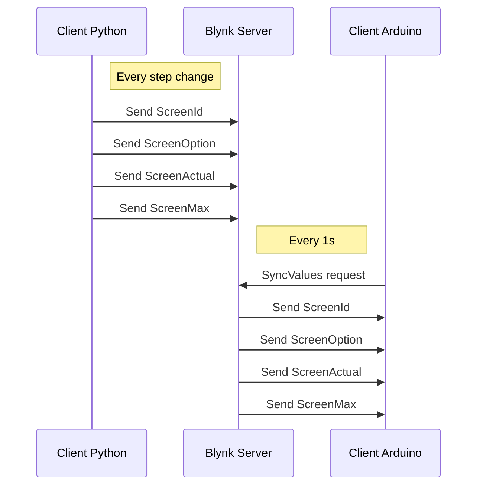

# Rollout-makers
Rollout project for the 2019 We make it happen Contest

## Project Description
The project is a home automation screen.
Multiples event can be shown on the screen.

The project is composed of several components:
 - The screen, running on esp32
 - A detector to start event from the esp32
   * On movement detection start a bike/car compare on the screen for morning boost
 - A Blynk server that host screens commands
 - Multiples python clients to update the screen on :
   * Home automation event
   * Jenkins event
   * Running script event 
 
### Screens commands

The blynk server host the followings elements:
 - ScreenId (V10)
 - ScreenOption (V11)
 - ScreenActual (V12)
 - ScreenMax (V13)
 - ScreenText (V14)

### Client/Server interactions

To read the following diagram use [stackedit](https://stackedit.io/app#)

### Command table

| Id  | Option | Actual | Max | Action on screen                
|-----|--------|--------|-----|---------------------------------
|  0  |   id   |    -   |  -  | Default welcome screen, draw a picture, option is the picture id
|  1  |    -   |    y   |  z  | Test bench running screen : line1 = ScreenText line2 = y / z
|  1  |    1   |    -   |  -  | Test bench Fail screen 
|  1  |    2   |    -   |  -  | Test bench Success screen 
|  2  |    -   |    -   |  -  | Jenkins Alert screen : line1 = ScreenText line2 = FAILD
|  3  |    -   |    -   |  -  | Mobility Companion screen : option/actual choose the mobility to compare
|  4  |    -   |   %    |  -  | Battery screen : actual is 0% to 100%
|  5  |    -   |   -    |  -  | 
|  6  |    -   |   -    |  -  | 
|  7  |    -   |   -    |  -  | 

### Mobility id table

| MobilityId | type 
|------------|--------------
|     1      | Walk
|     2      | Bike
|     3      | Tram/Bus
|     4      | Car

### Picture table

| PictureId | Picture 
|-----------|--------------
|     0     | No
|     1     | Walking man
|     2     | Bike 
|     3     | Car
|     4     | Train
|     5     | 
|     5     | 

### Difficulties during development
Understand how work with the google APi and make the existing google API library working again. Due to updates of other libraries, This last one didn't work anymore.
In addition, we added the transportation option, in order to match with our project. 

